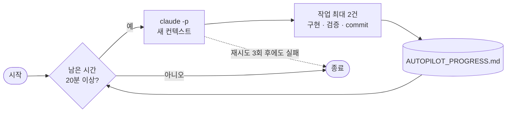

<p align="center">
  
</p>

Claude Code로 프로젝트를 무인 자율 개발시키는 데스크톱 앱입니다.
정해 둔 종료 시각까지 Claude가 스스로 개선점을 찾아 구현하고, 검증한 뒤 commit하는 과정을 반복합니다.
앱 하나(Windows 포터블 exe)에서 대상 프로젝트, 작업, 종료 시각, 정책, 모델을 모두 정하고 시작합니다.

## 장점

- **긴 실행에도 품질이 유지됩니다.** 회차마다 새 컨텍스트로 시작하므로 밤새 돌려도 대화가 길어져 판단이 흐려지거나 compact 비용이 쌓이지 않습니다.
- **중간에 끊겨도 이어갑니다.** 작업이 끝날 때마다 `AUTOPILOT_PROGRESS.md`를 갱신하므로, 세션이 죽거나 PC가 재시작돼도 다음 회차가 그 문서만 보고 이어받습니다. 이 문서는 프로젝트가 아니라 앱 데이터 폴더에 있어서 저장소에 섞이지 않습니다.
- **되돌리기 쉽습니다.** 작업은 `ai/autopilot` 브랜치에만 쌓이고, 검증을 통과한 작업 하나가 commit 하나가 됩니다. 마음에 들지 않는 변경은 commit 단위로 골라 버릴 수 있습니다.
- **삭제가 없습니다.** 지워야 할 파일도 `recycle_bin`으로 옮기기만 하므로 원래 경로 그대로 복구할 수 있습니다.
- **모델 장애에 강합니다.** Opus가 실패하면 Sonnet으로 넘어가고, 회차가 실패하면 5 · 15 · 30분 간격으로 재시도합니다. 그래도 실패하면 헛돌지 않고 멈춥니다. 사용량 한도에 걸리면 리셋 시각까지 기다렸다가 이어갑니다.
- **시간을 지킵니다.** 종료 시각은 엔진이 판정하고, 한 작업을 안전하게 끝낼 시간(20분)이 없으면 새 작업을 시작하지 않습니다. 종료 시각이 되거나 한 회차가 2시간을 넘기면 멈춘 세션도 강제로 끝냅니다.
- **내 작업이 먼저입니다.** 화면에 적은 작업을 순서대로 처리하고, 정책에 따라 거기서 끝내거나(`지시개선`) 남은 시간에 스스로 개선(`자율개선`)합니다.
- **확실하지 않으면 건드리지 않습니다.** 의도를 모르는 코드, 영향 범위를 모르는 변경, 테스트할 방법이 없는 변경은 건너뛰고 다른 작업을 고릅니다.
- **설치할 것이 없습니다.** exe 하나로 동작하고 Node.js도 필요 없습니다. Git과 Claude CLI는 별도로 설치해야 합니다.

## 사용법

1. [Releases](../../releases)의 `AutoPilot-<버전>-x64.exe`를 받아 실행합니다. 직접 만들려면 `npm run dist`입니다(아래 개발 참고).
2. 화면 아래 **프로젝트** 줄의 **폴더 선택**으로 대상 프로젝트를 고릅니다. `.git`이 있는 Git 저장소의 루트 폴더여야 하고, commit이 하나 이상 있어야 합니다. 고르기 전에는 시작 버튼이 잠겨 있습니다.
3. 버튼 아래에서 모델 · Effort · 종료 시각 · 정책을 정하고, **작업** 칸에 처리할 작업을 한 줄에 하나씩 적습니다.
4. **시작**을 누릅니다. 작업 범위(프로젝트 루트)는 엔진이 회차마다 알려주므로 따로 설정하지 않습니다.

| 항목 | 화면 | 기본값 |
|---|---|---|
| 대상 프로젝트 | 아래 줄의 폴더 선택 | 없음(필수) |
| 작업 | 작업 칸. 위에서부터 순서대로 최우선 처리 | 비움. `지시개선`은 필수 |
| 종료 시각 | 종료 | 비우면 `07:00`. 시각만 읽고 날짜는 무시하며, 이미 지난 시각이면 다음 날로 봅니다 |
| 개선 정책 | 자율개선 · 지시개선 | 자율개선 |
| 모델 | Fable · Opus · Sonnet · Haiku | Opus |
| Effort | low · medium · high · xhigh · max | high |

입력한 값은 다음 실행 때 복원됩니다(프로젝트는 고를 때, 나머지는 시작할 때 저장). 가운데 버튼 하나가 상태에 따라 바뀝니다.

| 버튼 | 동작 |
|---|---|
| 시작 | 엔진을 시작 |
| 종료 신호 | 현재 회차를 마친 뒤 리포트를 쓰고 종료 |
| 종료 | 종료 신호 뒤에 표시. 확인 후 즉시 강제 종료(commit 전 변경은 working tree에 남음) |

모델과 Effort는 실행 중에도 바꿀 수 있고, 진행 중인 회차는 그대로 끝난 뒤 **다음 회차부터** 적용됩니다. 창을 닫으면 확인 후 실행 중인 엔진을 강제 종료합니다. 자세한 화면 설명은 [desktop/README.md](desktop/README.md)를 보세요.

> **주의**: `claude`는 `--dangerously-skip-permissions`로 실행되므로 **신뢰할 수 있는 프로젝트에서만** 사용하세요.

설정 폴더는 사용자 홈의 `.claude`입니다. Opus가 실패하면 Sonnet으로 넘어가며, Sonnet을 직접 고르면 fallback은 쓰지 않습니다.

### 개선 정책

| 값 | 동작 |
|---|---|
| `자율개선` | 작업을 마친 뒤에도 스스로 개선점을 찾아 종료 시각까지 계속 |
| `지시개선` | 작업만 처리하고, 끝나면 시간이 남아도 즉시 종료 (`autopilot/progress/<날짜>/TODO_COMPLETE` 생성으로 신호) |

자율개선의 작업 우선순위: 버그 → 안정성 → 데이터 손상 가능성 → 성능 → 기능 완성도 → 유지보수성 → UX → 코드 정리

## 동작 방식

앱이 자기 실행 파일을 Node로 실행해(`ELECTRON_RUN_AS_NODE`) 엔진 `autopilot/core/autopilot_loop.js`를 자식 프로세스로 띄우고, 엔진(`autopilot/src/services/autopilotService.js`)이 `claude -p`를 회차마다 새로 실행합니다.



- 매 회차가 새 컨텍스트로 시작하므로 auto-compact 누적 비용이 없습니다.
- 회차 간 인수인계는 `AUTOPILOT_PROGRESS.md`가 맡습니다. 프로젝트 저장소가 아니라 `%APPDATA%\AutoPilot\projects\<프로젝트 폴더명>-<경로 해시>\AUTOPILOT_PROGRESS.md`에 두며, 같은 프로젝트의 다음 실행이 이어받습니다. 경로는 프롬프트와 로그 헤더(`Progress`)에 나옵니다. 지우려면 화면의 **진행 기록 초기화**를 쓰세요.
- **매 회차를 시작할 때** 진행 기록이 100줄을 넘으면 원본을 `autopilot/progress/<시작 날짜>/AUTOPILOT_PROGRESS_<고유 ID>.md`에 보관하고, 그 회차가 인수인계 정보와 최근 완료 5건만 남겨 60줄 안팎으로 정리하도록 지시합니다. 모든 회차가 이 문서를 읽으므로 하루 동안 문서가 계속 커지는 것을 막기 위해서입니다. 보관 실패 시 원본을 유지하고, 정리를 지시했는데도 다음 회차에 여전히 넘으면(남겨야 할 정보가 많은 경우) 100줄 아래로 내려갈 때까지 다시 지시하지 않아 회차마다 정리만 반복하지 않습니다.
- 작업이 모두 끝난 실행(지시개선의 작업 완료, 연속 idle 종료)은 **종료할 때** 진행 기록을 초기화합니다. 이미 끝난 작업의 기록을 회차마다 읽고 갱신하느라 토큰을 쓰지 않도록, 원본을 `autopilot/progress/<날짜>/`에 보관하고 문서에는 보관 경로 한 줄만 남깁니다. 종료 시각 도달 · 회차 상한 · 실패 · 중단으로 끝난 실행은 이어갈 내용이 있으므로 그대로 둡니다. 화면 아래 **진행 기록 초기화**로 지금 바로 초기화할 수도 있습니다(실행 중에는 막습니다).
- 한 회차는 최대 2건의 작업을 처리하고 commit한 뒤 종료합니다.
- 남은 시간이 20분 미만이면 새 회차를 시작하지 않습니다. 회차는 최대 60회입니다.
- 한 회차는 최대 2시간이고, 종료 시각이 더 가까우면 그때까지입니다. 시한을 넘긴 회차는 하위 프로세스까지 강제 종료하고 실패로 셉니다(commit 전 변경은 working tree에 남습니다).
- 새 commit 없이 끝난 회차가 연속 2회면 남은 작업이 없는 것으로 보고 종료합니다.
- 실패하면 5 · 15 · 30분 간격으로 재시도하고, 연속 4회 실패하면 중단합니다. 대기가 종료 시각에 걸리면 바로 끝냅니다.
- 사용량 한도로 회차가 실패하면 실패로 세지 않고 리셋 1분 뒤까지 기다립니다. 리셋이 종료 시각에 걸리면 바로 끝냅니다.
- 같은 프로젝트에서 AutoPilot이 이미 실행 중이면 새 실행을 거부합니다. `autopilot/progress/RUNNING`에 pid · 실행 파일 이름 · 이번 실행의 로그 파일을 기록하고 종료할 때 지웁니다. 강제 종료로 남은 잠금은 프로세스가 없거나 다른 프로그램이 pid를 재사용했으면 낡은 것으로 보고 덮어씁니다. 앱을 닫았다 켰을 때 엔진이 아직 실행 중이면 `status`로 확인해 다시 연결합니다.
- 실행을 시작할 때 30일이 지난 날짜 폴더의 로그와 리포트(`autopilot_*.log` · `report_*.html`)를 지웁니다. 보관한 진행 기록 원본은 지우지 않습니다.

## 구성

```text
<저장소>/
├─ autopilot/                      엔진 소스. 앱에 내장되어(resources/engine/) 앱 exe가 Node로 실행한다
│  ├─ core/autopilot_loop.js         엔진 진입점
│  ├─ src/                           실행 엔진 (services/ 회차 실행 · utils/ 기능별 라이브러리 · utils/guideText.js 작업 지침과 안전 정책 본문)
│  ├─ package.json                   ESM 선언
│  └─ .gitignore                     이 저장소를 대상 프로젝트로 쓸 때 progress/ · recycle_bin/을 git에서 제외
├─ desktop/                        Electron 앱 (프로젝트 선택 · 설정 · 시작/종료 · 로그 표시)
├─ tests/                          임시 프로젝트 통합 검증
├─ docs/                           README · 앱에서 쓰는 로고
├─ legacy/                         보관한 PowerShell 구현
├─ .github/workflows/              CI · 릴리스
└─ package.json · .prettierrc · .gitignore · CLAUDE.md · AGENTS.md   개발 설정
```

실행하면 대상 프로젝트에는 작업 폴더만 생깁니다. 엔진이 `autopilot/.gitignore`(`*`)를 함께 만들어 프로젝트 git에는 잡히지 않습니다.

```text
<대상 프로젝트>/autopilot/
├─ progress/                       회차 로그 · 아침 리포트 · 실행 잠금 · model/effort 변경 · 보관한 진행 기록
└─ recycle_bin/                    삭제 대신 이동된 파일
```

엔진은 선택한 프로젝트 폴더를 **프로젝트 루트**로 보고 거기서 `claude`를 실행합니다. 대상 프로젝트의 `CLAUDE.md`가 기본 지침으로 쓰입니다.

## 안전 정책

자세한 내용은 [autopilot/src/utils/guideText.js](autopilot/src/utils/guideText.js)를 보세요.

- 모든 작업은 `ai/autopilot` 브랜치에서만 합니다. 없으면 `main`에서 분기합니다.
- 허용 범위 밖의 파일은 수정하지 않습니다. 예외는 프롬프트가 알려주는 앱 데이터 폴더의 진행 기록 하나뿐입니다.
- 프로젝트의 `autopilot/` 작업 폴더는 대상이 아닙니다. 완료 마커와 `recycle_bin`만 씁니다.
- 파일을 삭제하지 않고 `autopilot/recycle_bin`으로 옮깁니다.
- `git reset --hard` · `git clean` · force push · history 재작성 · stash drop 금지.
- 운영 서버·DB 조작, 인증정보 변경, 새 외부 서비스·dependency 추가 금지.
- commit은 검증을 마친 작업 단위로, 메시지에 `[ap]` 접두어를 붙입니다. 예: `[ap] fix: 상태 손실 방지`
- 프로젝트 고유의 보호 대상 데이터나 금지 사항은 엔진 정책이 아니라 대상 프로젝트의 `CLAUDE.md`에 적습니다.

## 참고

- 회차 진행(세션 ID · 사용한 도구 · 결과 요약과 비용 · stderr)이 앱의 로그에 실시간으로 표시되고 `autopilot/progress/<날짜>/autopilot_<HHmmss>_<고유 ID>.log`에도 쌓입니다. 여러 줄 출력의 이어지는 줄은 4칸 들여써서 기록하므로, 줄 맨 앞은 항상 엔진이 직접 남긴 줄입니다.
- 회차의 전체 대화는 대상 프로젝트 루트에서 `claude --resume <세션 ID>`로 열어 볼 수 있습니다.
- 앱은 리포트를 자동으로 열지 않습니다. 실행 중에는 현재 회차 · 남은 시간 · 최근 로그를 30초마다 갱신하고, 끝나면 회차별 결과 · 소요 시간 · 비용(API 환산) · commit과 변경 규모 · 세션 요약 · stderr, 남은 미commit 변경을 한 장에 담은 최종본이 됩니다. 화면 아래 **리포트 열기**로 엽니다.
- 엔진은 CLI로 직접 실행할 수도 있습니다(디버깅용). `node autopilot/core/autopilot_loop.js --project <폴더> --end-time 07:00 --policy todo --tasks-file tasks.md`처럼 실행하고, `stop` · `status` · `set --model sonnet --effort low` · `reset-progress`에도 `--project`를 붙입니다. Node.js 22.12 이상이 필요합니다. 앱의 화면 설정과 같은 인자를 앱이 대신 넘깁니다.
- 진행 기록만 수정한 회차는 새 commit이 없으므로 idle이며, exit 0이어도 결과의 `is_error`가 true이면 실패로 처리합니다. 완료 마커는 성공한 지시개선 회차에서만 인정합니다.
- 기존 PowerShell 구현(`autopilot_loop.ps1`, `check_progress_archive.ps1`)은 기록 관리용으로 `legacy/autopilot_legacy_ps1_2026-10-08.zip`에 압축해 두었습니다. 새 실행 경로는 이 파일을 사용하지 않습니다.

## 개발 · 검증 · 빌드

엔진은 Node.js 내장 모듈만 사용합니다. 패키지 설치는 개발·패키징에만 필요합니다. Electron 앱(`desktop/`)은 엔진을 import하지 않고 앱 exe를 Node로 실행해 엔진을 자식 프로세스로 띄웁니다.

```sh
npm ci
npm run test:cli
npm run test:desktop
npm test
npm run format:cli
npm run format:desktop
npm start
npm run dist
```

- `.prettierrc`는 `29commerce_backend`에서 복사했습니다. ESM, 4칸 들여쓰기, 큰따옴표, 세미콜론, trailing comma 없음으로 통일합니다. 변수·함수는 camelCase, 상수는 UPPER_SNAKE_CASE, 서비스·유틸 파일은 camelCaseService.js/camelCaseUtil.js를 사용합니다. 공개 서비스는 try/catch와 오류 로그를 갖추고 `{ status: STATUS_OK, data }` 또는 `{ status: STATUS_FAILED, error: { code, msg } }`를 반환합니다. 실패한 실행의 보고서 데이터는 `data`에 함께 유지합니다. 포맷터는 수정한 JS 파일만 지정합니다.
- `test:cli`는 임시 Git 저장소와 가짜 Claude를 사용합니다. 실제 Claude 세션이나 대상 프로젝트는 실행하지 않습니다. 인자 해석, 프로젝트 · 작업 폴더, 앱 데이터 폴더의 진행 기록, 프롬프트의 작업 블록, 진행 기록 보관 · 초기화, 정상 commit, idle, 재시도, 사용량 한도, STOP/TODO_COMPLETE, UTF-8, 프로세스 트리 종료, SIGINT·SIGHUP 처리, 동시 실행 잠금(pid 재사용 포함), 오래된 로그 정리, 데스크톱 앱이 읽는 로그 형식과 위조 줄 차단, CLI 진입(작업 파일 · `status` · `set` · `reset-progress` · `stop`)을 확인합니다.
- `test:desktop`은 가짜 CLI로 앱의 엔진 제어(시작 · 종료 신호 · 강제 종료 · 로그 해석 · 다시 연결)와 허용 값 일치, 프로젝트 · 경로 검사, 표시 함수를 확인합니다. `npm test`는 Electron 창 · preload와 번들 엔진 실행(`ELECTRON_RUN_AS_NODE`)을 확인한 뒤 종료합니다.
- `npm run dist`는 Windows x64 포터블 exe를 `dist/AutoPilot-<버전>-x64.exe`로 만듭니다. 앱 asar에는 `desktop/`과 로고가, 엔진은 `resources/engine/`에 들어갑니다. `npm run build`로 만든 `dist/win-unpacked`의 엔진까지 검증하려면 `node tests/checkAutopilot.js dist/win-unpacked/AutoPilot.exe`를 실행합니다.
- `.github/workflows/ci.yml`은 Windows에서 포맷 검사, `test:cli`, `test:desktop`, Electron 스모크(`npm test`)를 실행합니다.
- `.github/workflows/release.yml`은 `v<버전>` 태그를 push하면 위 검증을 거쳐 포터블 exe를 GitHub Release로 올립니다. 태그는 루트 `package.json`의 버전과 같아야 합니다. 배포 exe는 게시자 서명이 없으므로 Windows에서 경고가 표시될 수 있습니다.
- 시한 초과나 SIGINT/SIGTERM/SIGHUP에는 Windows에서 `taskkill /T /F`를 사용합니다. 자식이 별도 세션으로 이탈하는 실행 방식은 추적 대상이 아닙니다.
